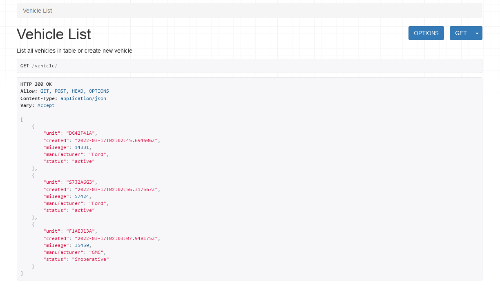
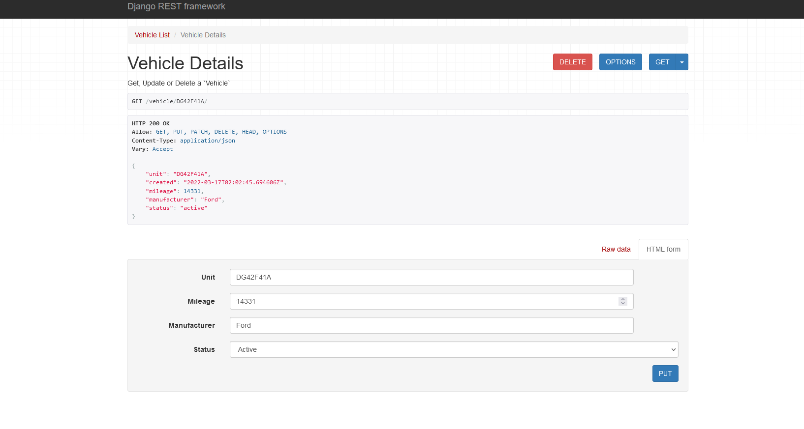
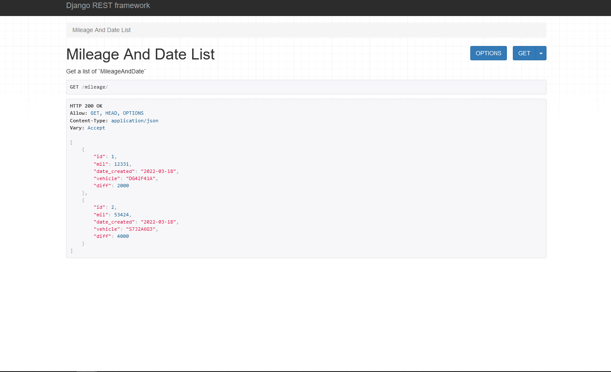
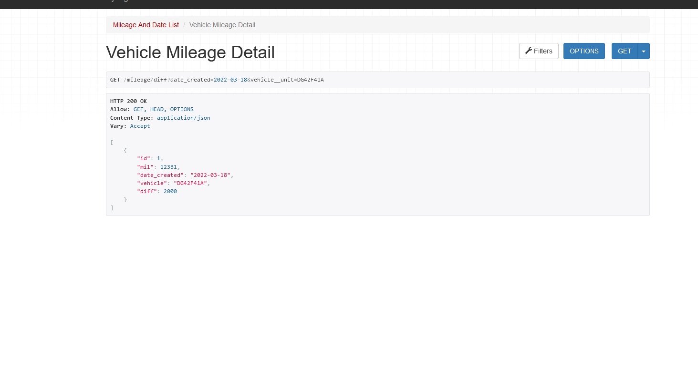

# Installation

1. First, you'd start by opening git bash
2. Then, change the current working directory to the location where you want the cloned directory
3. Type the following in the bash terminal:
   `git clone https://github.com/ShadFyt/skyit_challenge.git`

4. Setup virtual environment in the root directory with the following:
   `python3 -m venv env`

5. Active virtual environment
   `source env/bin/activate`
   on windows `source env/Scripts/activate`

6. Download dependencies with the following:
   `pip install -r requirements.txt`

7. Cd into project directory
   `cd mysite`

8. Run dev server
   `python3 manage.py runserver`

9. Finally, open the web browser to `http://localhost:8000/vehicle/`

**This route shows the Vehicle Table**

**To access Vehicle detail page go to http://localhost:8000/vehicle/< unit # >** example: `http://localhost:8000/vehicle/DG42F41A`
You can also update the mileage on this route and in doing so will create a instance of `MileageAndDate`

`http://localhost:8000/mileage/`
**This route shows the `MileageAndDate` Table**

**To access `MileageAndDate` detail page go to `http://localhost:8000/mileage/diff?date_created=2022-03-18&vehicle__unit=DG42F41A`** you can change the `date_created` & `vehicle__unit` params to a different `MileageAndDate` Instance

